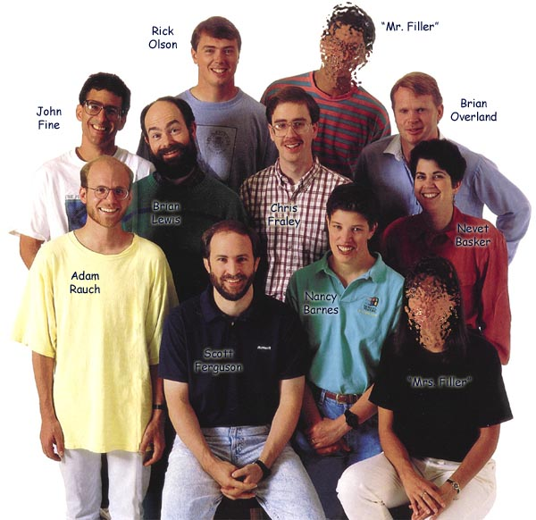

# Thunder... the birth of Visual Basic
# Source: http://www.forestmoon.com/birthofvb/birthofvb.html

Visual Basic was conceived when “Ruby” met “Embedded Basic” for the first time in August of 1989. Ruby was a “shell construction set” originally created by Alan Cooper and his team of developers, purchased by Bill Gates and Microsoft with the original intent of being included with Windows 3.0. Embedded Basic (EB) was a language engine that was being developed for inclusion in the database product, code named Omega. I was not privy to the decision-making process or reasons that lead to the rejection of Ruby by the Windows group. [For his description of that story, see Alan Cooper’s Why I am called "the Father of Visual Basic".] Bill Gates sent a memo to management in the Business Languages group to see if we could find some way to mate Ruby with EB. John Fine, a senior Program Manager at the time, was tasked to respond to the memo and I was recruited as an EB developer with Windows experience for technical advice.

At the time the Business Languages group was organized within the Data Applications Business Unit (DABU) and focused on Omega while also maintaining QuickBASIC and the BASIC Compiler. But the senior development resources were busy in extended research mode designing a new, object-oriented (OO), Windows-based BASIC development environment of the future, code named Silver. So there was, understandably, considerable resistance to this distraction to create a one-off product, draining precious resources and creating a nightmare of compatibility issues with the group’s vision for the future.

It should come as no surprise that it’s always easier to sell an idea for a new product when there’s an illusion that most of the work has already been done; though I certainly don’t believe that Bill had such an illusion. His pressure to make something happen could not be ignored, but it could be placated with a team built from the most expendable resources. While most were “rookies” as leaders at Microsoft, these were still qualified individuals eager for the opportunity to prove themselves.

Scott Ferguson (that’s me) was enlisted as a first-time Development Lead and architect for the project. Adam Rauch, a new hire, was brought on as a first-time Program Manager. Together we owned and drove the vision of VB from the initial rough drafts of the product specification through to the shipped product. Chris Fraley, also a new hire, became the first dedicated VB developer and was especially instrumental in the design and development of the improved forms engine architecture. Brian Lewis was the lead developer of the EB team which, being primarily focused on the Omega project, had few resources to apply to VB-specific tasks, at least initially. Rick Olson was tapped for his first-time role as Testing Lead, Nevet Basker was brought on as a first-time Product Manager and Brian Overland was the Lead Writer. Thus “Thunder” was born!

Ruby employed a string-based system of messages between controls (reminding me of HyperCard). The first conservative draft of ideas included simply replacing the crude string language with BASIC. But these messages were modeled in a graph-like user interface whose complexity scaled rather poorly from shell construction set to general programming environment. So such ideas were quickly considered unworthy. The event model was evolving for Omega and could be molded into a unified concept suitable for VB and the longer term OO vision. We needed their code editor to make that work. So we decided, for better or worse, to leverage that existing code, porting it from Omega to VB. Given the strong reliance of this code on Omega’s complex application framework, this was roughly equivalent to reaching into a monkey’s brain and pulling out only the mushy bits relating to vision.

So it evolved that VB had three essential and roughly equivalent components: the EB language engine, consisting mostly of very tight assembly code being ported to Windows for the first time; a Forms engine, built upon the unfamiliar Ruby code from outside Microsoft; and the Shell, including the editor and framework from Omega as well as the project management and other UI being written from scratch.

Bringing these disparate elements together was a challenging task whose breadth was difficult to explain in schedule terms to those holding the opinion that combining these “ready-made” building blocks should be a snap. In particular, the Ruby messaging model interface was a complete mismatch for the evolving VB event model with it’s concepts of module scope and form-level events. And EB was not yet the reusable package that VBA (Visual Basic for Applications) would become. It’s not like you could just drop in a new EB DLL and press on. All traces of the existing Ruby language had to be excised and connections to EB put in place. Overlapping and redundant code between all three components also had to be sought out and unified as a common framework evolved.

The increase in scope from shell construction set to general programming environment explains the schedule’s escalation from a six-month, one-off effort to an 18-month full-blown product. Additions and extensions to Ruby, just to name a few, included:

Many new controls, properties and events.

Support for the Basic graphics statements (line, circle, ellipse, scale) were added to forms and the new PictureBox, including support for retaining and redrawing graphics as windows repaint.

System object functionality for such things as the clipboard and font enumeration.

DDE (the now ancient way of forming links between applications)

Form printing.

Hooks for help, localization and Computer Based Training (CBT).

Ultimately the forms engine evolved with the changing requirements to the point that little of the original Ruby code was left that could be recognized. Still there remained key concepts in the kernel architecture that would serve as a stable seed around which the growing technology could crystallize. While we were experts in the intricacies of Windows UI development by the end of the project, we had only rudimentary skills at the start. Fortunately we had the services of Ruby development “wizard” Michael Geary during the initial months of the transition to familiarize us with the internals of Ruby and teach us the “weirding way” of coercing the Windows USER APIs to make things happen that most Windows developers never cared about or experienced but were stressed to the breaking point by VB.

The support for “Custom Controls” was undoubtedly the most important Ruby concept retained by VB and the feature most often cited as responsible for the breadth of its success. As a feature, Custom Controls continued to fall off the cut list. But as developers we embraced it internally and kept it alive even as the architecture changed significantly with the hope that it would be resurrected. The feature’s high cost derived mostly from the testing and documentation efforts required. There would also be an effort to recruit and coordinate with third parties to build custom controls ready to ship with the new VB; plus development resources to assist all these efforts. At one time marketing even suggested that if we did not ship by Christmas we had just as well not ship the product at all! Fortunately Bill’s patient genius prevailed and he insisted that we increase the schedule and delay shipping to allow for Custom Controls. Once again, the idea that something was “mostly done” influenced the decision to get it done. And a whole new cottage industry was born as a side effect.

No product is developed in isolation, and especially at Microsoft there are requirements to support many “corporate strategic” technologies, like accessibility, conforming to the rotating standards established by the Windows UI Style Guide or the up-and-coming OLE (Object Linking and Embedding) specification. This load on VB1 pales in comparison, however, to today’s requirements. It also pales next to the constraints placed upon VB1 by the Omega and Silver projects. Both certainly provided the benefit of additional minds thinking about related problems and offering solutions of value incorporated in VB. Both also occupied resources that could have directly benefited VB and tripled the amount of coordination (and debate) required to manage the intersection of three entangled product specifications. As fate would have it, the Omega project was scrapped (somewhere in early to mid 1990) and the EB team would refocus almost entirely on VB. And eventually, of course, the Silver project would merge its vision of the future into VB. But not before Thunder shipped.

Further detail on the development of VB1 would certainly be tedious. I recall someone telling me that about 70 people in all disciplines were involved in the process, including significant efforts from Product Support and our talented Waterloo interns. We flew the team to Atlanta for Windows World ’91 where Visual Basic Version 1.0 was officially released to the world. Later at the 1991 PC Magazine Technical Excellence Awards in Las Vegas , Adam and I accepted the top award for VB in the Development Tools Category.

Near the end of the development cycle I was asked if Ruby comprised 15% or more of the product code, for the purpose of determining if credit should be given in the product to the Ruby creators. Given that the forms engine was roughly a third of the product and the recognizable parts of Ruby remaining there were surely less than half of that I might have said “no.” But I offered that rounding up seemed fair, given that VB would likely not have happened at all if it were not for Ruby being thrust upon us.

Thus it happened that the true seminal value of Ruby was not in its code or technology, but in providing the spark to make Visual Basic happen. As the title of “Father of Visual Basic” seems to have been taken, perhaps I’ll settle for the role of “Mother” and share that title with all those who actually bore the pains of labor.

For more images and video on VB, check out the [Visual Basic gallery](http://www.forestmoon.com/Gallery/?aid=1102).

This picture of the VB team leads comes from a recruiting brochure produced after VB1 shipped. “Come to Microsoft and you too can work on cool products!” The photographer thought he needed more people to balance out the composition, so he brought in two of his assistants to act as “filler”.

In January of 1989, long before we were introduced to Ruby, John Fine wrote a proposal for a language product called Visual BASIC. This name was only resurrected for consideration along with many others for Thunder’s final release, and wasn’t actually liked by all. Most everyone liked the name “Thunder”, along with it’s popular tagline: “The Power to Crack Windows”.

The Business Languages group was always very, very meticulous when it came to compatibility. My first significant contribution at Microsoft was to speed up the core graphics functions in the BASIC runtime to compete with Borland’s TurboBasic. I achieved significant improvements (about a factor of two) in the line-drawing algorithm by always drawing lines from left to right, simplifying the inner loop. But this starts the Bresenham error accumulation at the opposite end of the line in half the test cases. So some pixels along the line might appear displaced by one pixel from the previous implementation. The result was not wrong, just different. Still, it took almost as long to get this change approved as it did to implement it, due to concerns over breaks with compatibility.

I have not seen a product before or since that had such thorough and quality testing. Leveraging VB’s own programmability to test itself, our testing team achieved code coverage near 95 percent. And being involved with the developer “unit test” suite and build process from the beginning, they helped maintain a high level of quality throughout.

The VBX file extension adopted for Custom Controls was suggested by developer Lee Acton, who was responsible for most of the editor, project manager and general UI components of VB1.

VB development began in the days before Windows 3.0 simplified memory management by breaking the 64K limits of the segmented architecture. VB would eventually ship a year after Win 3.0, but there remained reluctance from management and marketing to abandon the old “real mode” and the users whose computers could not support the new and improved virtual memory mode. Project review meetings with Bill are often subject to interpretation, with various factions applying spin to Bill’s words after the fact to suit their agendas. But the words “Fuck real mode!” were hard to misinterpret and a real boon to the development efforts.

Tim Paterson, the father of MS-DOS, was a key developer on the EB team. He can keep more variables in registers at one time than anyone I know! Check out his pages on the [“Origins of DOS”](http://www.patersontech.com/dos/origins-of-dos.aspx).