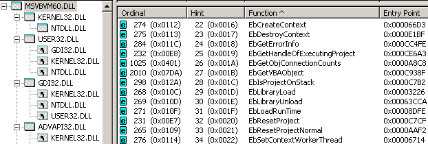
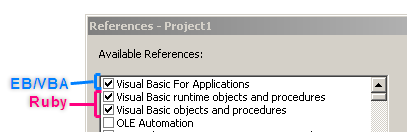
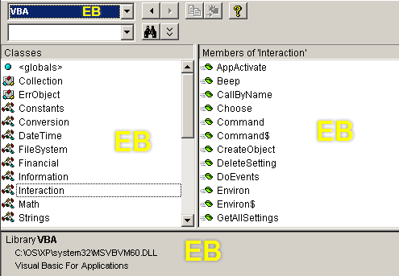
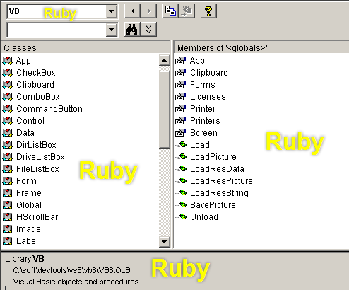
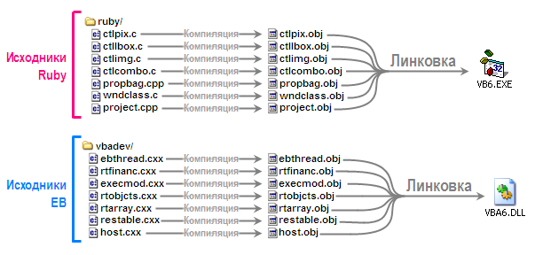
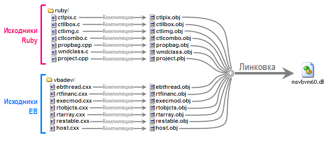
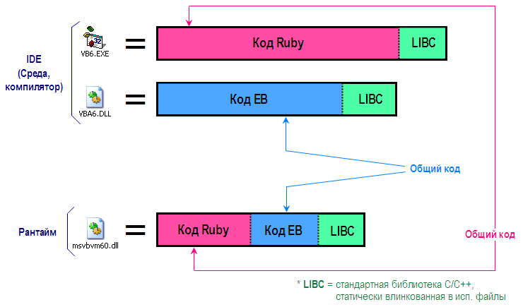
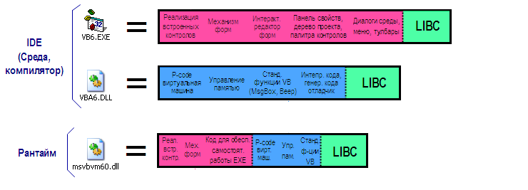

# VBStreets conference
# 10. Ruby + EB = Visual Basic
Source: http://bbs.vbstreets.ru/viewtopic.php?f=101&t=56551

Before my serious immersion in the study of the inner world and the VB6 device, I, like many probably, had a similar idea in my head: VB is the main product, while VBA is a by-product, the result of cutting back the main product in terms of functionality and attachment to Office applications such as Excel, Word. But it often happens that the average person’s view of the structure of things, built on the basis of attempts to predict this structure, can be completely different from the true structure. And in this case, this is our case: in fact, everything turned out to be quite the opposite, and not VBA is a by-product from the creation of VB, but rather VB is a by-product of the appearance of VBA. 

This article will shed some light on what two major parts Visual Basic consists of, what ideological background and what people are behind the appearance of each of them into the world. 

As it was already possible to guess from the above, there are two large components. This is Ruby and EB . Perhaps the most successful statement about all this: Visual Basic is the result of the "marriage" of Ruby and EB - two technologies that appeared independently of each other, and very well suited to each other . 

## Ruby 
A very important point to be made before we go further: here and hereafter the word "Ruby" has nothing to do with the Ruby programming language and the Ruby on Rails framework . After all, the word "ruby" translates simply as "ruby." 

If you have ever looked for information about how Visual Basic was born, you probably came across wikipedia or somewhere else on similar words: 
May 1991 - Visual Basic 1.0 is released for Microsoft Windows. The QBasic syntax was taken as the basis of the language, and the innovation that brought great popularity to the language was the principle of communication between the language and the graphical interface. This principle was developed by Alan Cooper and implemented in the Tripod prototype (also known as Ruby ). The first Visual Basic was the interpreter.

From an article about Alan Cooper himself, you can find out that he, in particular, is known as the "father of Visual Basic." The English version of the article is a bit more informative. 

In fact, Alan Cooper did not work at Microsoft, was not part of the VB development team - his merit is different. Alan Cooper came up with the concept of easy creation of visual shells and, together with his colleagues, created a tool for building visual shells. Let me remind you that we are talking about the 80s and the time when the OS with graphical interfaces was just gaining popularity, and the mainstream was DOS and other OS with a text interface. 

The product that Alan Cooper's team made was called Ruby, and the most interesting thing was that it was not a tool for programmers — it was a tool for ordinary users without special skills, which, according to Cooper's plan, gave them the ability to quickly blind the visual shell, which would facilitate some kind of work. A kind of designer of visual interfaces for a wide range of people. Oh, this is the time of the romantics, who believed that it was worth giving people a computer - and everyone would learn and write their own programs to make the computer do exactly what the owner needs. Ruby was neither a programming language, nor an integrated development environment (IDE) in the modern sense. 

According to Cooper's story, when he saw Windows 1.0, he realized that this platform has a great future. He was pleasantly struck by two things: a graphical interface and the concept of a DLL, which allows you to make dynamically configurable extensible systems, but at the same time the then Windows shell (Explorer and desktop in the modern sense did not exist yet) seemed to him just awful. And then he decided to write his ideal shell for Windows. Communicating with his clients and trying to understand what the ideal shell should be, Alan Cooper realized that the ideal shell does not exist. And what should be given to users is a tool that will allow each of them to design their own shell, tailored to their needs and their tasks, rather than trying to push through them to some ideal shell, while trying to explain to them what its ideality is. This custom shell builder was originally called Tripod, but was later renamed Ruby, since the name Tripod was used by many people. 

Later, Alan Cooper showed his work to Bill Gates. Gates concept that the user can draw visual controls, place them anywhere on the working field, drag, resize and, most importantly, with the controls to link some actions , I liked so much that he decided to buy Ruby. From now on, Microsoft became the owner of Ruby and determined the future fate of the product. 

Microsoft decided to change the essence of Ruby: leaving the concept of easy construction of visual interfaces (“drew a button where needed and quickly tied an action to it”) from a tool for creating visual shells (over existing programs) with a target audience users, turn it into a tool for creating new programs with visual interfaces, the target audience of which would be only programmers. Let me remind you that, starting from Ruby, apart from the principle of visual design, there was no programming language (there was only a simple system of commands, the set of which was expandable by plug-in DLLs, as well as the set of controls in the palette (Cooper called them “gizmo”, which translated into Russian - “gizmo”, this term is preserved in VB6), which also expanded with third-party DLLs, and it was necessary to determine which language would form the basis of the new tool. But Microsoft already had QBASIC, and one can guess exactly what plans were born in Bill Gates’s head when he decided to buy such a promising asset as Ruby. 

In this place of history, the concept and mechanism for constructing visual interfaces, completely devoid of any programming language behind them, was to meet with the programming language and the mechanism ensuring its execution, completely devoid of the visual component. 


## EB 
Have you ever looked at how many different undocumented functions are exported by VB runtime? 



Certainly , you should have heard about the EbExecuteLine function, which allows you to interpret and execute an arbitrary line of code (but only when working under IDE). Did you care? What does the “Eb” prefix mean in the names of all these functions? How does it stand for? 

Now we will deal with this. 

I'm not sure exactly which of the two versions of the two possible decrypts is more true, but, obviously, both versions are not far from the truth. Let's start with the first version and turn to this for one of the articles of the notorious Joel Spolsky . 

[The article is called “ My First BillG Review ”](https://www.joelonsoftware.com/2006/06/16/my-first-billg-review/)

A brief retelling of the story:
In the summer of 1991, Joel got a job at Microsoft in the Excel department. One of the actual problems of Excel at that time was that Excel had its own poor programming language for macros, in which there were no global and local variables, there were no procedures, there was a goto, but there were no labels. The language had no name of its own, and it was conditionally called “Excel Macros”. 

Joel's task was to solve this problem. Vitalo believed that the solution to the problem should be somehow related to the Basic language. In another department (as part of Microsoft), there was already time to create object-oriented BASIC code-named “Silver”. The Silver team manager saw only one application for his technology - Excel. Joel convinced people from the BASIC team that the Excel team needed something like BASIC for Excel. At the same time, he managed to insist that 4 features should be added to the language: 

1. Add Variant variables that can store values ​​of any other types, otherwise it would have been impossible to save the value of an Excel table cell in a variable (at least without resorting to Select Case ). 
2. Add late binding (via IDispatch), because the original Silver architecture required a deep understanding of the type system, and in it people who write macros for Excel would not want to understand.
3. Add a For Each construct, borrowed from csh .
4. Add the With ... End With construction, borrowed from Pascal.

After that, Joel sat down and wrote a specification for the future language **E**xcel **B**asic , which took about 500 pages, which was then sent to Bill Gates for review / verification. A further part of the article describes a meeting with B. Gates that took place after that, at which he asked Joel questions based on notes in the margins left by Gates while reading the specification. 

The final part of the article says that over time, the situation has progressed greatly, **E**xcel **B**asic became known as Visual Basic for Applications , and Gates once remembered how difficult it was to hire that sensible manager for the Excel team who did all this.
So, as you can see from the text of the article, at some point the need to replace the poor macro language in Excel with something more advanced led to the fact that the rate was made on basic-like languages, and on the basis of the existing developments in another department Object Oriented BASIC-like language, Excel Basic (abbreviated EB ) was created - an object-oriented universal language suitable for automating almost anything, and therefore quickly went beyond pure Excel in terms of applicability. Since the language allowed writing macros / extensions / automatization not only for Excel, but for anything, the technology was used not only in Word / Access - Microsoft managed to sell it to the creators of [AutoCAD](https://en.wikipedia.org/wiki/AutoCAD) , [SolidWorks](https://en.wikipedia.org/wiki/SolidWorks) , [Corel Draw](https://en.wikipedia.org/wiki/CorelDRAW) , [ArcGIS](https://en.wikipedia.org/wiki/ArcGIS) . It is clear that technology with such a wide scope of application could no longer be called Excel Basic and was renamed Visual Basic for Applications , especially considering that in addition to the programs in Office and third-party programs, this technology became an integral part of what is known as simply Visual Basic . In this case, the abbreviation “EB” is rooted in the name of the set of functions and structures related to the technology, where it remains to this day. 

The second version of EB decryption is not Excel Basic, but Embedded Basic. According to the story of Scott Ferguson (who jokingly calls himself "Visual Basic's mom"), at the turn of the 80s and 90s, Microsoft was working on the Omega DBMS - a project that was eventually abandoned. The structure of the database "Omega" was part of the engine Embedded Basic (EB). The development was in the department, which was called the “department of programming languages ​​for business” and was engaged simultaneously with the development of QuickBASIC. But the main resources of the department of “programming languages ​​for business” were concentrated on the creation of a new, object-oriented, Windows-based BASIC-like programming language called Silver (we already met the mention of this name and this product in the story of Joel Spolsky). At some point, Bill Gates sent a request to the "Business Programming Languages" section about whether it was possible to cross Ruby and EB in some way . John Fine (project manager at the time), together with Scott Ferguson, were tasked to respond to this request. 

A team was created that took up the very difficult integration of their EBs with the one just purchased from Ruby.


The new product, born from the merger of EB and Ruby , was named Thunder (traces of this name survived up to VB6 in the names of many internal functions (for example, ThunderMsgLoop ) or in the names of window classes (for example, ThunderRT6FormDC ). Scott Ferguson recalls that in January 1989 John Fine wrote (probably to his superiors, possibly to Gates himself) a proposal to create a programming language called Visual BASIC. It was long before the appearance of Ruby at Microsoft. Much later, before the release of the Thunder product, this name was resurrected from oblivion along with many other Gimi candidate names, considered as the official name of the product. And, in fact, many did not like it. Most liked the name “Thunder” (translated as “Thunder”) with the slogan “The Power to Crack Windows ” (translated - “The power opening the Windows” or, perhaps, the “Power that makes the Windows shake”). 

Anyway, it is not so important whether to decrypt EB as Excel Basic or Embedded Basic . Judging from the words of Joel about his contribution to the introduction of 4 important innovations in EB , which remained in VB / VBA to this day, his vision of the history and contribution to the development of the formation of VB and VBA should also be taken into account. 

Obviously, there was the Silver technology and the EB engine, originally created for the Omega DBMS. 
EB itself, not without Joel, entered Excel and became what is now known as VBA. 
EB, merged with Cooper Ruby, influenced by the ideas of Silver, became what is now known as VB. 
The project “Omega” with the existing EB in it was supposedly reincarnated as Access / MS Jet, in which EB is still a significant part. 


## The current state of affairs 

Up to the latest version of the product - to VB6, the boundary between Ruby and EB did not dissolve, both of these components did not merge to the point of indistinguishability. There is still a clear boundary between them, each component deals with its own, has, so to speak, its own area of ​​responsibility and the area of ​​tasks to be solved. 

The separation is maintained even at the source level (information about the sources from which VB is compiled can be obtained from files with debugging symbols). From the point of view of the source package, VB6 consists of two folders: ruby / and vbadev / 

The first one contains all Ruby source codes, the second one contains all EB source codes (which, as we know from Joel’s article, were renamed VBA at some point). For many functions and variables from Ruby, we will see the prefix Rby as a prefix, and for many functions, variables, and EB structures, we will see the prefix Eb . 

### EB - what it includes, what it does and what it answers for:

* EB / VBA as a whole is designed as a technology that can be screwed to anything — to any external application (for such an application, the term “host” / “host” is used). Being attached to a host, EB / VBA allows you to write code that can interact with the host, manage the object model of the host, which ultimately makes it possible to expand the logic of the host’s work and write automation for any host applications to which EB was attached. / Vba .
* EB / VBA does not depend on a specific host - this host depends on EB / VBA , and EB / VBA can be screwed to anything. 
* EB + Excel gives us VBA in Excel. 
* EB + Word gives us VBA in Word. 
* EB + AutoCAD gives us VBA in AutoCAD. 
* EB + Ruby gives us what we know as an “independent VB” (standalone VB, VB1 — VB6). 
That is, Ruby is only a special case of a host for EB . Ruby cannot live without EB , but EB can live with any other host.
* The code editor with syntax highlighting, autocompletion, and IntelliSense is part of EB / VBA . We are talking about the text field itself, in which the code is written, not including toolbars, toolbars, menus. It is for this reason that the code editor is identical in VBA and VB.
* The virtual machine that executes the P-code is part of EB / VBA .
* The mechanism for parsing a VB code and translating it into a P code using just-in-time compilation is part of EB / VBA . Therefore, the syntax of the language is also part of EB , and has no relation to Ruby , and for this reason, in all hosts to which EB is attached, the language will be the same with the same syntax rules and features (for example, the Not Not bug Arr will appear everywhere).
* The set of fundamental types and the set of operators supported by the language ( And , Xor , Like , & ) is part of EB / VBA , so no matter what host EB / VBA is attached to, all this will be the same everywhere. If you are a host developer and you have full control over the source code of the host, but EB is a black box for you, then you will not be able to achieve the appearance of support for a new operator in the code (for example, a bit shift operator that is not originally available).
* The concept of error handling is part of EB / VBA, so wherever EB / VBA is screwed on, everything will be the same everywhere.
* The concept that everything is divided into projects, and projects consist of modules (more precisely, project items - project elements) flows from EB / VBA . At the same time, EB has no idea about any forms and UserControls - from the point of view of EB modules are only two types (normal and object). The host can set its own subspecies for object modules. In VB6, these are classes, forms, user controls. In Excel, these are classes, user forms, worksheets and workbooks. Some other hosts may have their own subspecies of modules. But the overall concept of projects and modules will exist in any host.
* The concept of linking to third-party type libraries is an EB / VBA mechanism, and therefore it is in VB and in all VBA applications. The very same link to the TLB-shku connected to the project inside EB is called EBREF and is described by the same structure.
* All functions known to most as "function runtime," such as the MsgBox , the InputBox , the Rnd , Beep , the CreateObject , DateDiff , the RGB , StrReverse , MkDir - all part of the EB / the VBA , but because all of these functions will necessarily prisutvovat not only in pure VB, but also in VBA: in Excel, in Word, in AutoCAD, and in any other host.
* The Collection and ErrObject classes are part of EB / VBA , and, similarly, can be found in pure VB and in Microsoft Office applications and other hosts.
* Such undocumented and therefore little-known mechanisms, such as the expression server and the VBA event monitoring system, are also part of the EB .
* Anything that is somehow connected with the user interface and some visual manifestations during the execution of the program is in principle not part of EB . For example, the MsgBox function, which is part of EB (VBA) and shows a message dialog box, does not directly display the window - EB has no idea how the message should be shown and with what means it can be done. Instead, EB refers to its host and calls the host a special callback function that is responsible for the visual part of the message display. Between EBand the host has an interaction interface, such as an array of pointers to callbacks provided by the host. When the host initializes the EB , it calls the EB function EbInitHost on EB and passes it the array. EB remembers the pointer to this array and, when it comes to the need to show a message, takes the corresponding element of the array (this address is the corresponding callback function) and calls the desired function. And it is the host code that determines how the message will be displayed, whether this window will be, what window it will be and what design it will have. In this regard, EB is made so universal that the host for EB can serve, for example, a full-screen game using DirectX. And in this game, an appeal to MsgBox will not lead to the appearance of a normal Windows dialog that breaks the full-screen mode - the callback function implemented by the game host will display a message in the game style, which will be displayed by rendering using DirectX, as well as the entire other UI.

### Ruby - what does it do, what does it do and what is it responsible for:

* First of all, I must say that Ruby has no idea (and does not care about it) what language is behind the code that controls the infrastructure - the one that Ruby provides. In the case of VB , EB is used in conjunction with Ruby , but a purely hypothetical C / C ++ code could stand there, or some scripting engine or a visual programming system like Scratchin which code is not written, but drawn in the form of flowcharts and diagrams. By the way, according to Alan Cooper's original idea, this is exactly how Ruby worked: when a user drew a pair of gizmo, say, a button and a listbox, in order to make the listbox disappear when you click on the button, the user would draw an arrow from “click” events of the first gizmo before the “hide” method of the second gizmo. So...
* All VB controls (controls), such as the CommandButton, ListBox, Drive, Circle, PictureBox, ScrollBar, are all part of Ruby .
* The App , Clipboard , Forms , Printers collection , Screen object , Load and Unload methods , LoadPicture / SavePicture method are all part of Ruby . For this reason, if you open VBA in Excel, you will not be able to write an App.Path or Screen.ActiveForm there - there will simply be no App and Screen, for this is part of Ruby , not EB .
* The form engine that windows are based on is Ruby .
* All window processing, filtering, forwarding, and turning window messages into control events are Ruby .
* A significant part of the development environment (IDE) and how to draw forms in design-time is Ruby . For example, a project tree, a component palette, a property panel, a project properties dialog, environment dialogs, a mechanism for supporting add-ons — everything is Ruby .
* All the support mechanisms required for running independent EXE files, as well as for projects that compiled to form DLL / OCX files, as well as ActiveX EXE projects, are all Ruby . For example, any ActiveX DLL must have a DllGetClassObject function that returns the class factory for the requested class. DllGetClassObject and the class factory are all implemented in source files that are part of Ruby .
* Everything related to OLE, DDE and data-binding mechanisms (this is when controls on a form, for example, text fields, are attached to fields of the recordset and change themselves when moving through the rows in the recordset, and changing values ​​in controls leads to a change in values The database - and all this without writing additional (when from the VB-programmer's side, but simply by setting up the connection between the form controls and the database) - all this is Ruby .

Here is a separation. Assuming that you have full VB sources in your hands, and you need to correct something in the behavior of the button or add a new property to the forms, go to the Ruby sources . If you want to fix something in the built-in class Collection or threatened to add a new operator in VB, go to the EB source . 

The separation in Ruby and EB is visible not only at the source level. If we go to Project → References, we will see there are several connected type libraries that cannot be disabled. One of them fits everything EB brings , the other two matches everything Ruby brings : 



EB / VBA has its own type library, and you can find all the built-in runtime functions in it, as well as two single classes — Collection and ErrObject : 



If we open Visual Basic in Excel, we will see the same type library in References and Object Browser — and all functions will be in place. 

Ruby has its own type library, where you can find all the built-in controls and objects like App , Printers , Screen : 



## Anatomy of VB6.EXE, VBA6.DLL and MSVBVM60.DLL 

Everyone knows that a compiled VB project will inevitably depend on MSVBVM60.DLL- as soon as they call this library (both runtime and virtual machine VB). In the meantime, the project exists in the form of source codes and is debugged under the IDE, its work is provided by the IDE itself, consisting mainly of two binaries:

* Vb6.exe
* VBA6.DLL (VB6.EXE depends on it)

A fact that may seem surprising to someone: the filling of the msvbvm60.dll is half the filling of VB6.EXE , and half of the filling of VBA6.DLL . 

In fact, VB6.EXE is the result of compiling Ruby sources , and VBA6.DLL is the result of compiling EB sources . 
The runtime MSVBVM60.DLL is just about half Ruby and half EB . 


Two sets of sources ( ruby  *and vbadev*), personifying the two main components of this product, as a result of compilation and linking with different keys and options, result in 3 executable files. 

That is, there is no such thing as “source codes of MSVBVM60.DLL” and “source codes of VB IDE” - both are compiled and compiled from the same sources! But with different options and compilation keys, with different conditional compilation flags. 

The IDE build process (VB6.EXE + VBA6.DLL) is as follows: 




The build process of the MSVBVM60.DLL runtime library is almost the same: the same source files are compiled (with slightly different compilation keys) into object files (obj), and then This is linked into one final DLL file:



Just as a person’s genetic code is 98% identical to a chimpanzee’s genetic code, the bulk of the binary code in msvbvm60.dll repeats the code from either vb6.exe or vba6.dll . Almost any procedure included in msvbvm60.dll is either part of Ruby or part of EB , and therefore can be found in the same or slightly modified form, either as part of vb6.exe or as part of vba6.dll . 

The reverse is not true: the total code size of vb6.exe (1.80 MB) and vba6.dll (1.61 MB) is larger than the size of msvbvm60.dll (1.32 MB).

Obviously, Ruby includes code that implements, for example, the form editor or the project properties dialog — all of this gets into vb6.exe , but does not get into msvbvm60.dll (it’s not needed there). 
Obviously, EB includes a code that implements parsing, analysis, compiling VB code into P-code - all of this falls into vba6.dll , but does not fall into msvbvm60.dll (it is not needed there). 

If you make some simplifications and do not aim to accurately observe the scale, the following illustration perfectly shows how the executable files that make up the IDE (environment) and the executable file, which is runtime, consist, in fact, of common code:



The above lists have been, albeit incomplete, but sufficient lists of things that are part of Ruby and are part of EB . If you simplify even more, discard too much and leave only the most prominent and often recalled VB components, you can put them on this illustration. Once again I want to say: this is a strong simplified image based on a highly simplified text. Its purpose is not to create a complete list of the subcomponents of which Ruby and EB are composed.. The full list does not fit on such a small picture, the picture would have to be done at least 20 times more. The goal is simply to look at the illustration to understand and feel the very idea, the very principle of separation. Get a rough idea of ​​which subcomponents (responsible for certain things) are part of Ruby, and which parts of EB, and how these subcomponents are distributed among executable files (VB6.EXE, VBA6.DLL and MSVBVM60.DLL). Here is a modified illustration: 



In the following articles we will talk in more detail about the composition of EB and Ruby, consider more fully the set of components that make up a workable VB IDE (after all, apart from VB6.EXE and VBA6.DLL, there is also LINK.EXE, C2.EXE , MSO98RT.DLL, etc.).

----

I wrote the text of this article about a year ago. 

Two translations of other articles written by people behind the creation of VB were made specifically for this article:

* Alan Cooper. Why they call me "the father of Visual Basic"
* Scott Ferguson. Thunder ... the birth of Visual Basic

I strongly recommend reading these two translations after reading this article in order to plunge into descriptions of the same things from the participants of the events.


~ Hacker

## Message NashRus »06/10/2019 (Mon) 14:56

>> and VBA is a by-product from the creation of VB, but rather VB is a by-product of the appearance of VBA. 

Yes, it follows from the commercial trend of MS. The office has always been a workhorse, it is now. Many Windows technologies migrated from the Office. This is a good example of synergy.
to come back to the beginning

## Message Debugger »06/10/2019 (Mon) 16:14

This is the coolest and most unusual thing that I read about Visual Basic (and about any other programming language, probably). 

Great!


## Message Teranas 11.06.2019 (Tues) 20:03

Great article, thanks!

## Message ger_kar »06.11.2019 (Tues) 21:11

Yes, an interesting article, and leads to certain reflections. It turns out that with the development of the MS Office product line, VBA (EB) is also evolving. But with the other part (Ruby) ambush. And if for the 64-bit platform - VBA was completely adapted to itself, then Ruby is completely deaf.

> **ger_kar wrote:**
> Yes, an interesting article, and leads to certain reflections. It turns out that with the development of the MS Office product line, VBA (EB) is also evolving. But with the other part (Ruby) ambush. And if for the 64-bit platform - VBA was completely adapted to itself, then Ruby is completely deaf.

Apparently over the past godya I completely behind. What is the development of VBA? Where does it develop it?
to come back to the beginning

## Message ger_kar »06/13/2019 (Thu) 18:41

> **Adam Smith wrote:**
> What is the development of VBA? Where does it develop it?

Well, at least in the MS Office products. I unfortunately do not have information about other products into which VBA was previously integrated, but the fact that 64-bit VBA is integrated into the 64-bit version of MS Office is a well-known fact. Also in the new versions of VBA added a number of new keywords. Here "The trick" the other day added a brick to the piggy bank , which besides everything is universal and designed for different versions of VBA and VB6. So, in the code of this brick, it is just possible to see some changes regarding new versions of VBA.

## Message Adam Smith »06/14/2019 (Fri) 6:37

Certainly respect the author. 
Sorry, but I did not see anything new and "64 bit" in the code. 
The timer itself in the 64-bit library? So what? 
Compatibility is that there is no difference from x86? 
Compiling a 64 bit exe that would be amazing. 
I do not judge, maybe I just did not wake up yet. 
Until now, even the linker from the 2010 studio has not broken off.
to come back to the beginning

## Message ger_kar »06/14/2019 (Fri) 7:26

> **Adam Smith wrote:**
> Compiling a 64-bit exe that would be amazing.

Well, it's about VBA, which generally does not produce any executable files and works exclusively with byte code. 

> **Adam Smith wrote:**
> Sorry, but I did not see in the code anything new and "64 bit".

Well, of course. Literally at the very beginning of the module, there are declarations of WInAPI functions and the following construction of the Private Declare PtrSafe Function immediately catches the eye in which you can see the new keyword PtrSafe, about which the official certificate reports the following:
The PtrSafe keyword is used in this context: Declare statement. 

Declare statements with the PtrSafe keyword is the recommended syntax. Here are the statements that have been updated for the use of the 32-bit and 64-bit platforms. for 64-bit integrals or LongPtr for pointers and handles. 

To ensure backward compatibility with VBA version 6 and earlier, use the following construct:

```vb
#If VBA7 Then 
Declare PtrSafe Sub... 
#Else 
Declare Sub... 
#EndIf
```

When running in the 64-bit versions of Office, Declare statements must include the PtrSafe keyword. The Declare Statement is safe for 64-bit development environments. 

Statement Declare statement 64 signatures targets 64-bits. Long-term for 64-bit and LongPtr for pointers and handles.

Translation of the first paragraph:
The keyword PtrSafe is used in this context: 
Operator declaration. 

Declaring statements with the PtrSafe keyword is the recommended syntax. Declare statements that include PtrSafe work correctly in the VBA7 development environment on both 32-bit and 64-bit platforms only after all the data types in the Declare statement (parameters and return values) that must be stored 64-bit quantities, updated to use LongLong for 64-bit integrals or LongPtr for pointers and descriptors. 

To ensure backward compatibility with VBA version 6 and earlier, use the following design:
...

Having walked through the documentation and going to this page you can see that new types of data have appeared in VBA, such as LongLong, LongPtr

## Message Hacker »06/14/2019 (Fri) 15:22

> **ger_kar wrote:**
> Well, it's about VBA, which generally does not produce any executable files and works exclusively with byte code.

And yet, in terms of Ruby + VBA, it is VBA that produces executable files. Whether this part of VBA was modified over time, or simply thrown out is unknown.

## Message ger_kar »06/14/2019 (Fri) 16:52

> **Hacker wrote:**
> And yet, in terms of Ruby + VBA, it is VBA that produces executable files. Whether this part of VBA was modified over time, or simply thrown out is unknown.
This is yes.But I meant exclusively pure VBA, included in MS Office, which has no documented ability to create executable PE files. It may in its depths contain some code responsible for creating such files, but in fact it does not create anything. By the way, what about the ability to create (draw) forms in VBA? For the same idea, Ruby is responsible. So VBA and Ruby are also present?

## Message Hacker »06/14/2019 (Fri) 17:12

> **ger_kar wrote:**
> By the way, what about the ability to create (draw) forms in VBA? For the same idea, Ruby is responsible. So VBA and Ruby are also present?

There is no Ruby in the office. The ability to draw forms there is implemented independently of Ruby, the implementation of controls there is completely different (MS Forms library for Office 2003 is FM20.DLL). The set of controls is different (there is no such control as PictureBox in principle), controls do not use WinAPI windows. The set of properties for all controls is different. 

But the main thing: a completely different anatomy of the internal structure of these controls. After the publication of the relevant articles in the cycle on the anatomy of the Ruby controls, it will be possible to return to this topic and compare.

## Message ger_kar »06/14/2019 (Fri) 19:23

> **Hacker wrote:**
> But the main thing: a completely different anatomy of the internal structure of these controls.

Yeah, the controls are completely different. In principle, MS Forms controls are quite personal, and even better than the standard VB6 controls (mostly for data binding), but the lack of PictureBox and the inability to use control arrays greatly complicates the VBA programming process. Especially annoying is the inability to use arrays of controls. Sometimes it really infuriates when, instead of a beautiful and concise implementation, you have to fence a garden of crutches: cry:

## Message jangle ”06/25/2019 (Tues) 11:23

Interesting article. When will the sequel be?
to come back to the beginning

## Message Hacker ”06/25/2019 (Tues) 14:32

Soon.